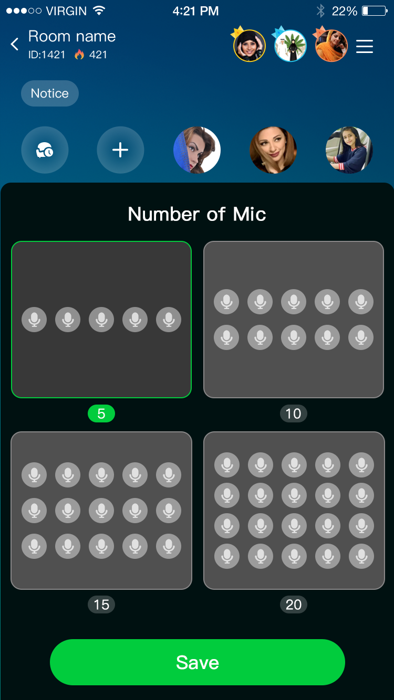
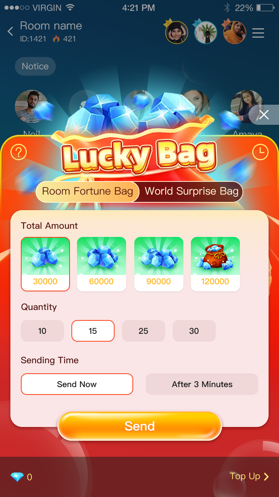
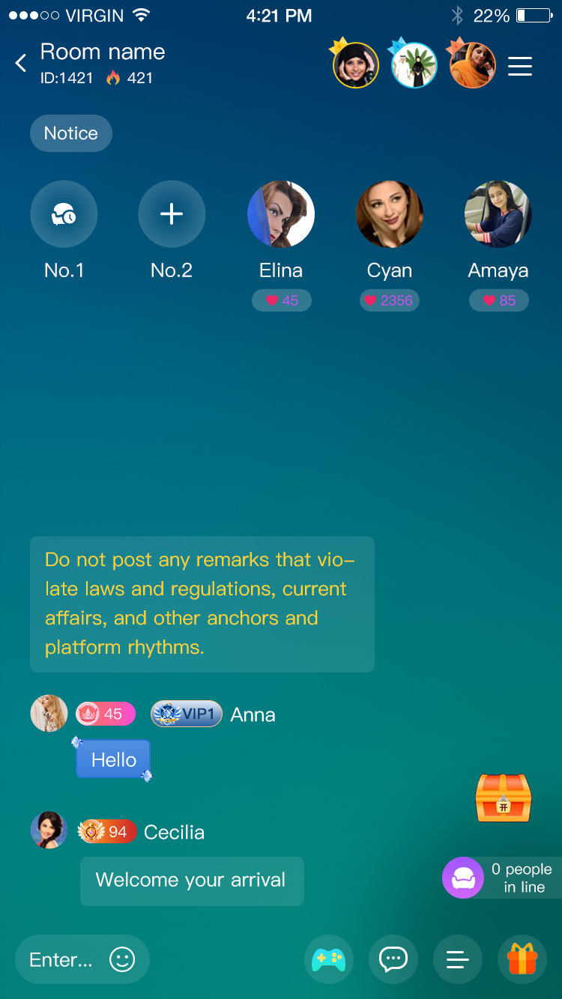

# Voice Chat App Script

**Voice Chat App Script** | **Live Streaming App Source Code** | **Audio Chat Room App Clone**

A production-ready **voice chat app script** for startups and agencies.
Build your own platform with **voice room**, **live streaming**, **1v1 call**, **gift system**, **short video**, and **social feed** features.

<!--
seo: voice chat app script, live streaming app source code, audio chat room app, voice room app, clubhouse clone, tiktok clone script, bigo clone script, social live app, real-time chat app, video call app source code
-->

## Product Screenshots
### Mic Seat Selection


### Room Red Packet


### 5-Seat Voice Room


## Main Features
- Multi-user voice chat rooms
- Live streaming and audience interaction
- Gifts, coins, wallet and recharge flow
- 1v1 voice/video call
- Short video feed and social moments
- VIP / noble level system
- Admin dashboard and content moderation
- Global deployment support

## Demo Code Included
This repository now includes a lightweight Node.js demo for room state simulation:
- Room seat management
- User join/leave flow
- Gift sending log stream

Run:

```bash
npm install
npm start
```

## Best For
- Entrepreneurs launching a social audio app
- Teams looking for a TikTok/Bigo style product
- Agencies delivering custom live app solutions
- Businesses needing fast MVP launch

## Contact
Contact me: WhatsApp: +44 7999 529473

WhatsApp Direct: https://api.whatsapp.com/send/?phone=447999529473&text=I%20would%20like%20to%20inquire%20more%20about%20Voice%20Chat%20App%20Script

## About Voice Chat App Script
This repository is focused on **voice chat app script** promotion and business inquiry.
If you are searching for **live streaming source code**, **audio chat room solution**, or **social app clone script**, this project is built for discoverability and direct contact.
